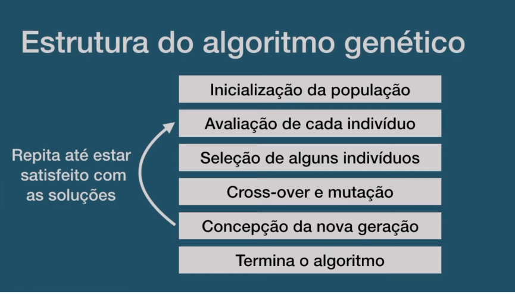
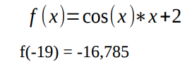

# Algorítmo genético.

Conceito
O algoritmo genético está relacionado com um dos ramos de pesquisa emergente da Inteligência Artificial, a Computação Evolucionária(CE), que propõe um novo paradigma para solução de problemas inspirado na Seleção Natural, de Darwin.
Criado em 1960 por John Holland, o algoritmo tinha o objetivo inicial de estudar os fenômenos relacionados à adaptação das espécies e da seleção natural que ocorre na natureza, propondo novas soluções para o conceito computacional. Os requisitos para execução desse algoritmo são resumidos nos passos a seguir:

Inicialmente escolhe-se uma população inicial, normalmente formada por indivíduos criados aleatoriamente;

Avalia-se toda a população de indivíduos segundo algum critério, determinado por uma função que avalia a qualidade do indivíduo (função de aptidão ou"fitness");

Em seguida, através do operador de "seleção", escolhem-se os indivíduos demelhor valor (dado pela função de aptidão) como base para a criação de um novo conjunto de possíveis soluções, chamado de nova "geração";

Esta nova geração é obtida aplicando-se sobre os indivíduos selecionados, operações que misturem suas características (chamadas "genes"), através dos operadores de "cruzamento" ("crossover") e "mutação".

O Fluxo de um algorítmo genético é dado por:  

